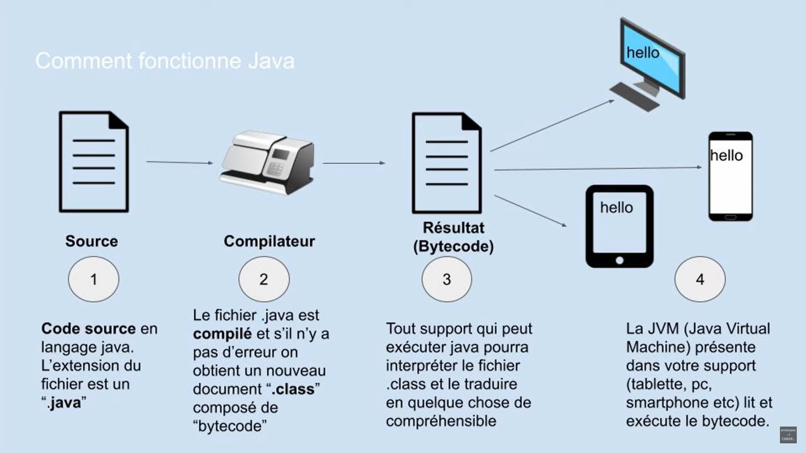
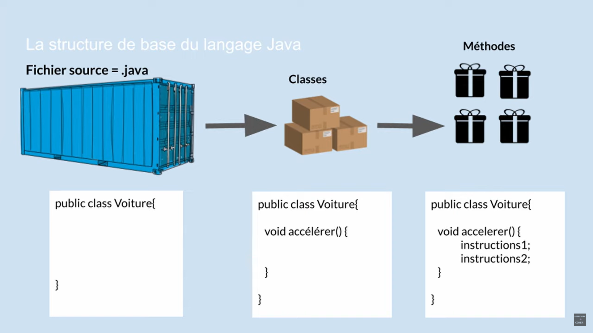

# Module 1. Algorithme et pseudocode. Dans ce module, vous verrez comment concevoir des algorithmes simples et comment les présenter de manière précise en français.

[Activités 1.0 et 1.1](https://inf1220-vw2.teluq.ca/module-1/activite-1-1/)
[Activité 1.2](https://inf1220-vw2.teluq.ca/module-1/activite-1-2/)
[Exercices 1.1](https://inf1220-vw2.teluq.ca/module-1/exercice-1-1/)
[Travail noté 1](https://inf1220-vw2.teluq.ca/module-1/travail-note-1/)

### Activité 1.0 

Révision de concepts mathématiques.

### Activité 1.1

[Les langages de programmation expliqués](https://www.youtube.com/watch?v=4-h1DEJ2K3o)

Compilateur traduit le code en binaire.
Plus un langage est facilement compréhensif, plus il est de haut niveau.
IDE = environnement de developpement intégré (éditeur de code source, compilateur et débuggeur qui va rechercher les erreurs de synthax)
Java possibilité d'être exécuté sur n'importe quel périphérique

Personnellement, je préfère [cette vidéo](https://www.youtube.com/watch?v=KOmibP9DuTc) de Michel Kartner. 
[Apprendre Java en 2 minutes](https://www.youtube.com/watch?v=LKgH-am4Xac)
[Apprendre les bases de Java de A \ Z en 1h20](https://www.youtube.com/watch?v=57qtOd9T-R8)

[Architecture de l'ordinateur](https://www.youtube.com/watch?v=msjBhHGcTKc&list=PL-SCBTAHBntP1F4-GjFgs0jxoumcrsPrx)

De nos jours et en des mots plus populaires, les ordinateurs sont composés principalement de plusieurs processeurs, de mémoire de travail (RAM), de mémoire long termes (disques durs), de processeurs graphiques et de cartes entrées/sorties. La carte mère coordonne le travail entre ces périphériques, processeurs et mémoires.

Il y a plusieurs grandes familles de processeurs. Les processeurs dans les PC sont généralement fabriqués par Intel et AMD et sont de type x64 (aussi parfois appelé x86, x86-64 ou amd64). Les processeurs dans les appareils mobiles (iPhone, Android) sont généralement de type ARM. La mémoire des ordinateurs prend généralement la forme de puces DRAM. Les disques utilisent le plus souvent la technologie flash.
Les langages de programmation servent principalement à spécifier des opérations à ces composantes de l’ordinateur pour traiter les données. Pour ce faire, elles utiliseront des niveaux d’abstraction plus ou moins élevés par rapport au matériel.

Bool
https://www.youtube.com/watch?v=dWoR6-toOCY&list=PL2aehqZh72LvM6VRvik9Pb-oCngTsB800